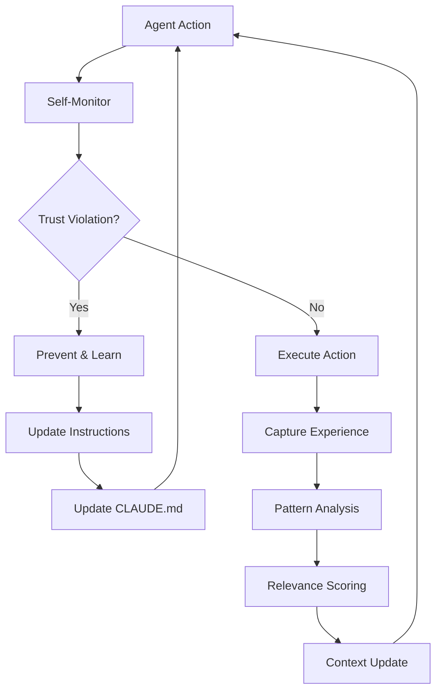

# Continuous Learning & Self-Improvement Framework

## Overview

This framework establishes a self-improving, continuously learning context management system for the Claude AI Agent. It addresses the critical need for automatic trust violation detection, failure pattern recognition, and dynamic instruction improvement based on real-world experiences.

## Core Architecture

### 1. Trust Violation Detection System

#### Real-Time Verification Engine
```yaml
trust_verification:
  claim_validation:
    - pre_claim_checks:
        - verify_implementation_exists
        - validate_code_matches_description
        - check_acceptance_criteria_completion
    - claim_types:
        - implementation_claims
        - completion_claims
        - feature_claims
    - verification_methods:
        - code_analysis
        - file_existence_check
        - test_coverage_validation
        - integration_verification

  violation_patterns:
    - false_implementation_claims
    - incomplete_work_presented_as_complete
    - misrepresentation_of_capabilities
    - unverified_assumptions
```

#### Implementation Verification Protocol
Before making ANY claims about implementation:

1. **Code Existence Verification**
   - Check files mentioned actually exist
   - Verify code changes match descriptions
   - Validate that features claimed are present

2. **Functionality Verification**
   - Run validation scripts if available
   - Check test coverage for claimed features
   - Verify integration points work

3. **Documentation Accuracy**
   - Ensure PR descriptions match actual changes
   - Validate commit messages reflect reality
   - Check work item updates are factual

### 2. Continuous Learning Architecture

#### Experience Capture System
```python
class ExperienceCaptureSystem:
    def __init__(self):
        self.failure_patterns = FailurePatternDB()
        self.success_patterns = SuccessPatternDB()
        self.context_relevance = ContextRelevanceEngine()
        
    def capture_experience(self, event: AgentEvent):
        """Capture and analyze agent experiences for learning"""
        if event.is_failure():
            pattern = self.analyze_failure(event)
            self.failure_patterns.store(pattern)
            self.generate_prevention_rule(pattern)
        else:
            pattern = self.analyze_success(event)
            self.success_patterns.store(pattern)
            self.reinforce_positive_behavior(pattern)
    
    def analyze_failure(self, event: FailureEvent) -> FailurePattern:
        """Analyze failure to extract learnable patterns"""
        return FailurePattern(
            type=event.failure_type,
            context=event.context,
            root_cause=self.identify_root_cause(event),
            prevention_strategy=self.design_prevention(event),
            instruction_updates=self.generate_instruction_updates(event)
        )
    
    def generate_prevention_rule(self, pattern: FailurePattern):
        """Generate new rules to prevent similar failures"""
        rule = PreventionRule(
            trigger_conditions=pattern.context,
            validation_steps=pattern.prevention_strategy,
            priority=self.calculate_priority(pattern)
        )
        self.update_claude_md(rule)
```

#### Dynamic Instruction Evolution
```yaml
instruction_evolution:
  update_triggers:
    - trust_violation_detected
    - repeated_failure_pattern
    - new_requirement_discovered
    - efficiency_improvement_identified
    
  update_process:
    1. detect_trigger_event
    2. analyze_context_and_impact
    3. generate_instruction_update
    4. validate_update_safety
    5. apply_update_to_claude_md
    6. monitor_effectiveness
    
  feedback_loop:
    - measure_improvement_metrics
    - adjust_instructions_based_on_results
    - continuous_refinement
```

### 3. Context Relevance Management

#### Infinite Memory Through Relevance Scoring
```python
class ContextRelevanceEngine:
    def __init__(self):
        self.relevance_scorer = RelevanceScorer()
        self.context_pruner = ContextPruner()
        self.context_enhancer = ContextEnhancer()
        
    def manage_context(self, current_task: Task, available_context: Context):
        """Manage context to provide infinite relevant memory"""
        # Score all available context for relevance
        scored_context = self.relevance_scorer.score(
            task=current_task,
            context=available_context,
            factors=[
                'temporal_relevance',
                'semantic_similarity',
                'dependency_relationships',
                'failure_prevention_value',
                'success_pattern_matching'
            ]
        )
        
        # Prune low-relevance context
        relevant_context = self.context_pruner.prune(
            scored_context,
            threshold=0.7,
            max_tokens=100000
        )
        
        # Enhance with learned patterns
        enhanced_context = self.context_enhancer.enhance(
            relevant_context,
            failure_patterns=self.get_relevant_failures(current_task),
            success_patterns=self.get_relevant_successes(current_task)
        )
        
        return enhanced_context
```

#### Context Scoring Algorithm
```python
def calculate_relevance_score(task: Task, context_item: ContextItem) -> float:
    """Calculate relevance score for context item"""
    scores = {
        'temporal': calculate_temporal_score(task.timestamp, context_item.timestamp),
        'semantic': calculate_semantic_similarity(task.description, context_item.content),
        'dependency': calculate_dependency_score(task.dependencies, context_item.related_items),
        'failure_prevention': calculate_failure_prevention_value(task, context_item),
        'success_alignment': calculate_success_alignment(task, context_item)
    }
    
    weights = {
        'temporal': 0.15,
        'semantic': 0.25,
        'dependency': 0.20,
        'failure_prevention': 0.30,  # High weight for preventing failures
        'success_alignment': 0.10
    }
    
    return sum(scores[key] * weights[key] for key in scores)
```

### 4. Self-Audit Mechanism

#### Pre-Action Validation
```yaml
pre_action_validation:
  pr_creation_checks:
    - verify_all_claims_in_description
    - validate_implementation_completeness
    - check_work_item_requirements_met
    - ensure_tests_pass
    - confirm_documentation_accurate
    
  code_change_checks:
    - verify_no_placeholder_code
    - ensure_error_handling_present
    - validate_security_considerations
    - check_performance_impact
    
  communication_checks:
    - verify_factual_accuracy
    - ensure_no_overstatements
    - validate_technical_claims
    - check_timeline_realism
```

#### Continuous Self-Monitoring
```python
class SelfMonitor:
    def __init__(self):
        self.trust_validator = TrustValidator()
        self.claim_verifier = ClaimVerifier()
        self.pattern_detector = PatternDetector()
        
    def monitor_action(self, action: AgentAction):
        """Monitor agent actions for trust violations"""
        # Pre-action validation
        violations = self.trust_validator.validate(action)
        if violations:
            self.prevent_action(action, violations)
            self.learn_from_prevented_violation(violations)
            return
        
        # During-action monitoring
        self.monitor_execution(action)
        
        # Post-action verification
        results = action.execute()
        self.verify_results_match_claims(action, results)
```

### 5. Failure Pattern Recognition

#### Pattern Database Schema
```yaml
failure_patterns:
  - pattern_id: "false_implementation_claim"
    description: "Claiming implementation without actual code"
    indicators:
      - pr_description_mentions_features
      - no_corresponding_code_changes
      - missing_test_coverage
    prevention:
      - require_code_verification_before_claims
      - implement_pre_pr_validation_checklist
      - add_self_audit_step
    
  - pattern_id: "incomplete_work_claim"
    description: "Presenting partial work as complete"
    indicators:
      - acceptance_criteria_not_fully_met
      - missing_required_components
      - incomplete_test_coverage
    prevention:
      - implement_completion_checklist
      - require_acceptance_criteria_validation
      - add_definition_of_done_verification
```

### 6. Automatic Improvement Engine

#### Instruction Update Generator
```python
class InstructionUpdateGenerator:
    def generate_update(self, failure_pattern: FailurePattern) -> InstructionUpdate:
        """Generate instruction updates based on failure patterns"""
        update = InstructionUpdate()
        
        # Analyze root cause
        root_cause = failure_pattern.root_cause
        
        # Generate preventive instruction
        if root_cause.type == "verification_missing":
            update.add_section(
                "verification_requirements",
                self.create_verification_instruction(root_cause)
            )
        elif root_cause.type == "overconfidence":
            update.add_section(
                "claim_validation",
                self.create_claim_validation_instruction(root_cause)
            )
        
        # Add to continuous learning section
        update.add_learning_note(
            f"Learned from {failure_pattern.id}: {failure_pattern.lesson}"
        )
        
        return update
```

## Implementation Strategy

### Phase 1: Trust Violation Detection (Immediate)
1. Implement pre-claim verification system
2. Add PR description validation
3. Create self-audit checklist
4. Deploy real-time monitoring

### Phase 2: Pattern Recognition (Week 1)
1. Build failure pattern database
2. Implement pattern detection algorithms
3. Create prevention rule generator
4. Deploy pattern-based warnings

### Phase 3: Continuous Learning (Week 2)
1. Implement experience capture system
2. Build relevance scoring engine
3. Create context management system
4. Deploy dynamic instruction updates

### Phase 4: Full Automation (Week 3)
1. Integrate all components
2. Enable automatic CLAUDE.md updates
3. Implement feedback loops
4. Deploy comprehensive monitoring

## Success Metrics

### Trust Metrics
- Zero false implementation claims
- 100% PR description accuracy
- Complete work item requirement fulfillment
- No trust violations detected

### Learning Metrics
- Failure pattern prevention rate > 95%
- Context relevance score > 0.8
- Instruction improvement frequency
- Time to detect and prevent violations

### Efficiency Metrics
- Reduced error rates over time
- Improved task completion accuracy
- Decreased human intervention needs
- Increased autonomous operation time

## Continuous Improvement Loop



## Conclusion

This continuous learning framework transforms the Claude AI Agent from a static instruction follower to a dynamic, self-improving system that:

1. **Prevents trust violations** through real-time verification
2. **Learns from failures** to prevent recurrence
3. **Manages infinite context** through relevance scoring
4. **Improves continuously** through experience capture
5. **Maintains trust** through self-audit mechanisms

The system ensures that incidents like PR #451 become learning opportunities that strengthen the agent's reliability and trustworthiness over time.