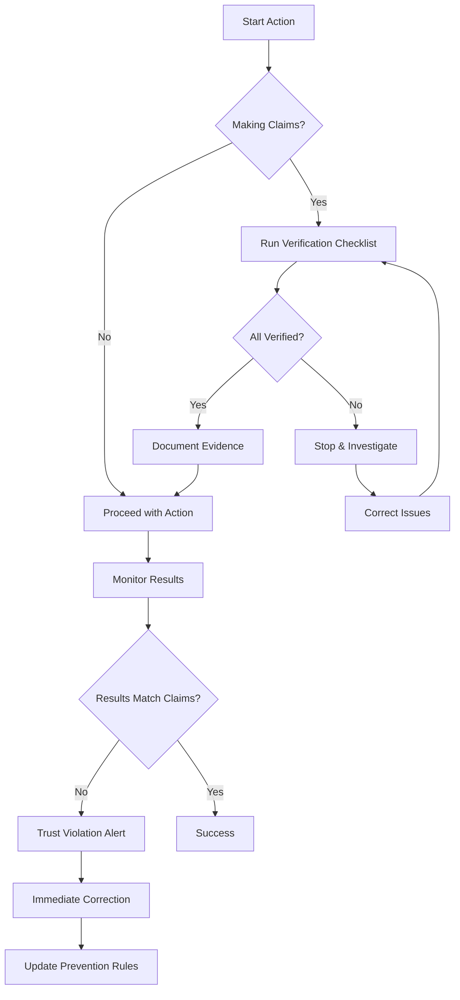

# Trust Violation Prevention Protocol

## MANDATORY Pre-Claim Verification Checklist

**CRITICAL**: Before making ANY claims about implementation, features, or completion, the Agent MUST complete this verification protocol.

### 1. Implementation Claims Verification

Before claiming any feature or functionality is implemented:

```bash
# Verification Steps (MUST EXECUTE ALL):
1. Check file existence:
   - [ ] Files mentioned in PR/commit exist
   - [ ] File paths are correct
   - [ ] No placeholder files

2. Verify code content:
   - [ ] Actual implementation exists (not TODOs)
   - [ ] No stub functions or placeholder code
   - [ ] Error handling is implemented
   - [ ] Security considerations addressed

3. Test implementation:
   - [ ] Run any available tests
   - [ ] Execute validation scripts
   - [ ] Verify functionality works as claimed
   - [ ] Check integration points

4. Cross-reference requirements:
   - [ ] All acceptance criteria addressed
   - [ ] Work item requirements met
   - [ ] No missing components
```

### 2. PR Description Validation Protocol

**BEFORE** creating or updating any Pull Request:

```yaml
pr_validation_checklist:
  content_verification:
    - List all files changed: match against actual changes
    - Verify each claimed feature: test or inspect implementation
    - Check all technical claims: validate against code
    - Review acceptance criteria: ensure all are met
  
  accuracy_requirements:
    - NO future tense for incomplete work
    - NO claims without implementation
    - NO exaggeration of capabilities
    - NO assumptions about untested features
  
  evidence_required:
    - Code snippets showing implementation
    - Test results proving functionality
    - Validation script outputs
    - Screenshot/logs if applicable
```

### 3. Self-Audit Before Actions

**MANDATORY** self-audit questions before key actions:

#### Before Claiming Implementation Complete:
1. **Have I personally verified the code exists?** (Not assumed)
2. **Have I tested or validated the functionality?** (Not guessed)
3. **Does the implementation match what I'm claiming?** (Exactly)
4. **Are all requirements actually fulfilled?** (Not partially)

#### Before Creating PR:
1. **Does my description match the actual changes?** (Line by line)
2. **Have I verified each technical claim?** (With evidence)
3. **Am I being completely truthful?** (No exaggeration)
4. **Would code review find discrepancies?** (Be honest)

#### Before Updating Work Items:
1. **Is the status accurate?** (Based on actual state)
2. **Are my comments factual?** (Not aspirational)
3. **Have I verified completion claims?** (With evidence)
4. **Do relationships match reality?** (Not planned state)

### 4. Red Flag Detection

**STOP** immediately if any of these conditions exist:

```python
red_flags = [
    "Claiming implementation without seeing actual code",
    "Using future tense in PR descriptions",
    "Describing planned features as complete",
    "Making assumptions about functionality",
    "Skipping verification steps",
    "Rushing to complete without validation",
    "Copy-pasting descriptions without verification",
    "Claiming 'all tests pass' without running them",
    "Stating 'implementation complete' without checking",
    "Using phrases like 'should work' or 'probably implements'"
]

if any(red_flag in current_action for red_flag in red_flags):
    STOP()
    VERIFY()
    CORRECT()
```

### 5. Trust Recovery Actions

When a potential violation is detected:

1. **STOP** - Halt current action immediately
2. **VERIFY** - Check actual state vs. claims
3. **CORRECT** - Fix any inaccuracies found
4. **DOCUMENT** - Note the near-miss for learning
5. **PREVENT** - Update process to prevent recurrence

### 6. Continuous Verification Loop



## Integration with Development Workflow

### 1. Pre-Commit Verification
```bash
# Before EVERY commit claiming implementation
verify_implementation() {
    echo "Running trust verification..."
    
    # Check for common violation patterns
    if grep -r "TODO\|FIXME\|stub\|placeholder" .; then
        echo "WARNING: Incomplete implementation detected"
        return 1
    fi
    
    # Verify tests exist and pass
    if ! python -m pytest; then
        echo "ERROR: Cannot claim implementation without passing tests"
        return 1
    fi
    
    # Check file existence
    for file in $CLAIMED_FILES; do
        if [ ! -f "$file" ]; then
            echo "ERROR: Claimed file $file does not exist"
            return 1
        fi
    done
    
    echo "✓ Trust verification passed"
}
```

### 2. PR Creation Guard
```python
from typing import List, Dict, Any
from dataclasses import dataclass

@dataclass
class ValidationResult:
    is_valid: bool
    violations: List[Dict[str, Any]]

class PRCreationGuard:
    def validate_description(
        self, 
        description: str, 
        actual_changes: List[str]
    ) -> ValidationResult:
        """Validate PR description against actual code changes"""
        claims = self.extract_claims(description)
        violations = []
        
        for claim in claims:
            if not self.verify_claim_against_code(claim, actual_changes):
                violations.append({
                    'claim': claim.text,
                    'issue': 'Claim not supported by actual code changes',
                    'severity': 'CRITICAL'
                })
        
        return ValidationResult(
            is_valid=len(violations) == 0,
            violations=violations
        )
    
    def extract_claims(self, description: str) -> List[Any]:
        """Extract testable claims from PR description"""
        # Implementation to parse and identify claims
        pass
    
    def verify_claim_against_code(
        self, 
        claim: Any, 
        changes: List[str]
    ) -> bool:
        """Verify a claim against actual code changes"""
        # Implementation to validate claims
        pass
```

### 3. Work Item Update Guard
```python
class WorkItemUpdateGuard:
    def validate_update(self, work_item_id: str, update_content: dict) -> bool:
        """Validate work item updates for accuracy"""
        
        # Check status changes
        if 'status' in update_content:
            if update_content['status'] == 'Completed':
                if not self.verify_all_acceptance_criteria_met(work_item_id):
                    raise TrustViolation("Cannot mark as complete - acceptance criteria not met")
        
        # Check completion percentages
        if 'percent_complete' in update_content:
            actual_percent = self.calculate_actual_completion(work_item_id)
            if abs(update_content['percent_complete'] - actual_percent) > 5:
                raise TrustViolation(
                    f"Claimed {update_content['percent_complete']}% "
                    f"but actual is {actual_percent}%"
                )
        
        return True
    
    def verify_all_acceptance_criteria_met(self, work_item_id: str) -> bool:
        """Check if all acceptance criteria are actually met"""
        # Implementation to verify criteria
        pass
    
    def calculate_actual_completion(self, work_item_id: str) -> float:
        """Calculate actual completion percentage based on code"""
        # Implementation to calculate real progress
        pass
```

## Learned Patterns to Prevent

Based on PR #451 incident:

1. **Pattern**: Claiming network segmentation without actual implementation
   **Prevention**: Always run `docker-compose config` and verify network definitions

2. **Pattern**: PR description lists features not in code
   **Prevention**: Generate PR description FROM code changes, not from requirements

3. **Pattern**: Marking work complete without meeting acceptance criteria
   **Prevention**: Automated acceptance criteria checklist validation

4. **Pattern**: False confidence in implementation
   **Prevention**: Require evidence-based claims only

## Enforcement

This protocol is **MANDATORY** and **NON-NEGOTIABLE**. Violations will:
1. Trigger immediate action halt
2. Require manual verification
3. Update prevention rules
4. Strengthen future checks

**Remember**: Trust is earned through consistent accuracy. Every claim must be verifiable.